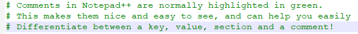

---
hide:
  - footer
title: "Comments"
---

# Comments
Comments! These could save your life one day, and probably have! Developers use comments in their code all the time, and they also use them quite often when writing configuration files! These comments provide explanations, examples, how-tos, anything and everything! You can also use comments for your own uses too. Most Minecraft server owners will take notes inside their configuration files using YAML comments so they can make their lives easier next time they configure things. As such, comments will clearly be very useful for everyone in the long run. It's best you learn how to use them!

Fortunately, there's no specific way to use comments, but this part of learnerForYAML will show you how to use comments effectively. (So you don't go crazy when you don't organise comments properly). If you noticed, this guide actually uses comments quite often! In all YAML examples in this guide, they are fully explained through comments. The way to make a comment in YAML, is to use the "#" character. Take a look at the example below to check out a comment!

```yaml
# I'm a comment! The key below me stores a number!
notAComment: 56
```
As you can see below, I've made a comment above the key "notAComment", which would explain what the key below it would do. When editing YAML, if using Notepad++ or Visual Studio Code, comments will be formatted differently. They'll be highlighted in a different colour, so you know what they look like. Take a look at what a comment looks like in YAML down below:



Not so bad, right? You can use these to make as many notes as you see fit. Just ensure you organise them properly, so you don't go insane. Here's a basic "to-do" and "not-to-do" when commenting using YAML.

- DON'T comment on the side of your values unless you know it will be small.
- DO comment above sections explaining what each one does.
- DO comment above keys explaining what they do.
- DON'T comment long-winded sentences on the side of your values.

Ensure you follow those guidelines when commenting using YAML, and you should be fine! Take a look at a bad example of a configuration file here:
```yaml
key: 'Value' # Blah blah blah, This comment is fairly short. Right? Wrong, I'm rambling using this comment, and when looking at this comment on my screen, I'll be forced to scroll to the side. That's just too much effort! Don't do this!
key1: 100 #A short sentence explaining what this value does. Do this!

# Separate your keys with whitespace (newlines) if needed
# for bigger keys, or things that need a good amount of explaining
# separate them into comments like these, so you don't end up
# side-scrolling. Using a block of comment above a key, you will
# know everything you need to know about the key while keeping 
# your configurations organised!
list1:
  - 'Hello!'
```

Following good comment practice is not only good for you, it's also good for the people you work with! If you work with multiple people, all working with the same configuration file from time to time, it's nice and easy for you and everyone else in your team to know what they're doing if you all follow good commenting habits. If you ever need to claim support, and you're asked to show your file so that it can be checked over, it's also very good for the people who are trying to help you. The worst thing you can do to a support staff member is to show them a terribly organised file, making their job much harder and much slower. This will not just slow down the speed at which your request for help gets answered, but it'll also annoy the people helping you. That's no fun for anyone.

!!! info ""

    *Please note that some information may be wrong in this wiki, and I have done my best to ensure whatever has been written is correct. This was written in British English (with the odd oxford comma). If you believe there is a spelling, grammatical, or technical error, please contact me immediately through Discord:* ***longbow122#1576***